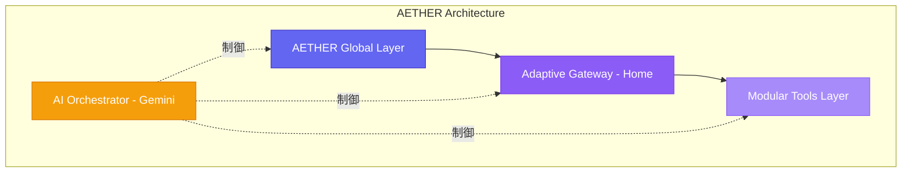
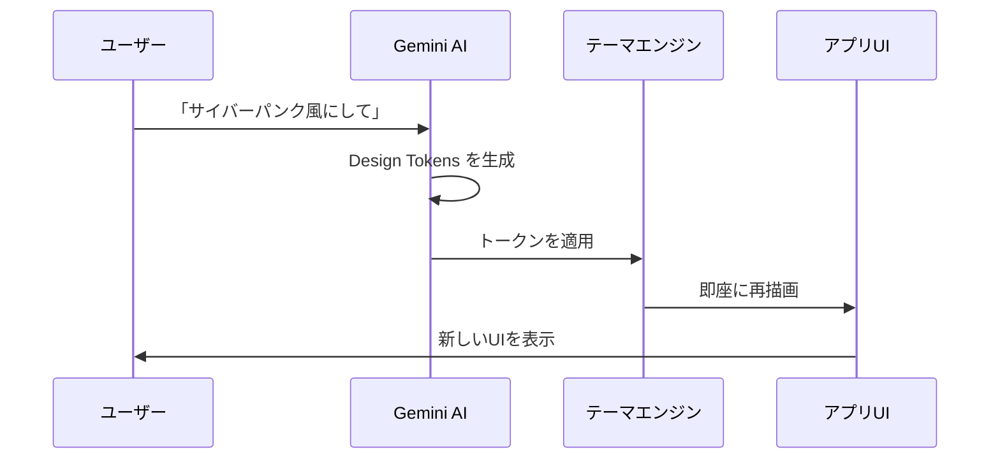

# AETHER (エーテル) プロダクト定義・設計仕様書

> **変幻自在なデジタル・コックピット**  
> すべての標準機能を一貫した意匠で統括し、AI（Gemini）がユーザーの感性と状況に即座に適応させる

---

## 目次

1. [プロダクト概要](#1-プロダクト概要)
2. [システム・アーキテクチャ](#2-システムアーキテクチャandroid最適化)
3. [主要機能要件](#3-主要機能要件)
4. [UI/UX カスタマイズエンジン](#4-uiux-カスタマイズエンジンgenerative-ui)
5. [グローバル・ナビゲーション設計](#5-グローバルナビゲーション設計)
6. [実装前準備](#6-実装前準備実務チェックリスト)

---

## 1. プロダクト概要

| 項目 | 内容 |
|------|------|
| **プロダクト名** | AETHER (エーテル) |
| **コンセプト** | すべての標準機能を一貫した意匠で統括し、AI（Gemini）がユーザーの感性と状況に即座に適応させる「変幻自在なデジタル・コックピット」 |
| **ターゲットプラットフォーム** | Android |
| **コアAIエンジン** | Google Gemini (Pro / Flash) |

---

## 2. システム・アーキテクチャ（Android最適化）

### 2.1 階層構造

| レイヤー | 説明 |
|----------|------|
| **AETHER Global Layer** | 全画面最前面に常駐する操作・AIアクセス層 |
| **Adaptive Gateway (Home)** | ユーザーの文脈を解釈して機能を再配置するハブ層 |
| **Modular Tools Layer** | 個別の標準機能（電卓、メモ、タイマー等）群 |
| **AI Orchestrator (Gemini)** | ユーザーの自然言語を解析し、UI変更や機能実行のコマンドを発行する脳 |

### 2.2 技術スタック

| カテゴリ | 技術 |
|----------|------|
| **開発フレームワーク** | Flutter (Android) |
| **AI連携** | Google AI SDK for Android (Gemini API) |
| **データ同期** | Android Content Provider / Google API 連携（カレンダー等） |
| **ローカルDB** | Room (SQLite) または Realm（プライバシー重視の高速処理） |

---

## 3. 主要機能要件

### 3.1 アダプティブ・ゲートウェイ（ホーム画面）

#### 動的プライオリティ表示
使用頻度や時間帯に基づき、Geminiが推奨機能を最前面に配置。

#### 3モード・ナビゲーション

| モード | 説明 |
|--------|------|
| **AI推奨（自動）** | Geminiが文脈に応じて機能を自動配置 |
| **カスタム** | ユーザーがフォルダを自作可能 |
| **オール・ファンクション** | 全機能の一覧表示 |

#### ワンタッチ・アクション
頻用する操作（例：「3分タイマー開始」）をタイルとして配置し、即座に実行。

---

### 3.2 搭載標準機能モジュール（一貫設計）

| カテゴリ | 機能 |
|----------|------|
| **計算・変換** | 電卓、単位/通貨換算 |
| **時間管理** | タイマー、アラーム、ストップウォッチ、カレンダー |
| **記録・管理** | メモ、ボイスレコーダー、ファイルマネージャー |
| **入力・取込** | スキャナー |
| **情報表示** | 天気/環境情報、通知アグリゲーター |
| **メディア・連携** | メディアコントローラー、アプリランチャー |

---

## 4. UI/UX カスタマイズエンジン（Generative UI）

> [!IMPORTANT]
> AIがデザインを制御するための共通言語「Design Tokens」を定義

### Design Tokens 一覧

| カテゴリ | トークン名 (JSON Key) | AIが制御する内容 |
|----------|----------------------|------------------|
| **Color** | `theme_palette` | ベース色、アクセント色、コントラスト比 |
| **Shape** | `component_geometry` | ボタンやカードの角丸、影の深さ、枠線の太さ |
| **Text** | `typography_preset` | フォント種別、サイズ、行間、カーニング |
| **Space** | `layout_density` | 余白（Padding/Margin）の広さ、グリッドの間隔 |
| **Motion** | `interaction_flow` | アニメーションの速度、イージング、振動の強さ |

### UI変更プロセス

---

## 5. グローバル・ナビゲーション設計

### 5.1 AETHER Trigger（AIアクセス）

| 機能 | 説明 |
|------|------|
| **常駐アイコン** | どの画面（電卓、メモ等）にいても、画面端のフローティング・トリガーから即座にGeminiを呼び出し可能 |
| **コンテキスト認識** | 今見ている画面のデータをGeminiが理解し、適切なサポートを提供 |

### 5.2 ユニバーサル・ホーム・アクション

| 機能 | 説明 |
|------|------|
| **一撃帰還** | 階層の深さに関わらず、ワンアクションでホーム画面（ゲートウェイ）へ戻る機能 |

---

## 6. 実装前準備（実務チェックリスト）

### ① Google Gemini API の構成

- [ ] Google AI Studio / Google Cloud Console でプロジェクトを作成
- [ ] Gemini 1.5 Pro (高度な推論用) と Flash (高速応答・UI生成用) の使い分けロジックを策定
- [ ] Function Calling（AIがアプリの機能を操作する仕組み）の定義書作成

### ② デザイン・マニフェストの作成

- [ ] AIが生成するデザインの「守り（最小/最大値）」を定義したマスター・スタイルガイドの作成
- [ ] 4〜5種の初期テーマプリセットの開発

### ③ Androidシステム連携

- [ ] カレンダー、連絡先、ファイルシステムへのアクセス権限（Permissions）の整理
- [ ] OS標準アプリとのデータ同期エンジンの設計

### ④ セキュリティ ＆ プライバシー

- [ ] ローカルLLMの活用検討（プライバシー強化のため）
- [ ] AI送信データの暗号化とユーザー同意プロセスの設計

---

> [!NOTE]
> 本仕様書は AETHER プロジェクトの設計基盤を定義するものです。実装フェーズに応じて詳細を追記・更新してください。

---

## 関連ドキュメント

| ドキュメント | 説明 |
|--------------|------|
| [ARCHITECTURE.md](./ARCHITECTURE.md) | システムアーキテクチャ設計 |
| [MONETIZATION.md](./MONETIZATION.md) | マネタイズ戦略・課金モデル |
| [DATA_MODEL.md](./DATA_MODEL.md) | データベース設計・ER図 |
| [GEMINI_FUNCTION_CALLING.md](./GEMINI_FUNCTION_CALLING.md) | AI連携の関数定義 |
| [DESIGN_TOKENS.md](./DESIGN_TOKENS.md) | UIカスタマイズエンジン詳細仕様 |
| [NAVIGATION_MAP.md](./NAVIGATION_MAP.md) | 画面遷移設計 |
| [UI_COMPONENTS.md](./UI_COMPONENTS.md) | 共通コンポーネントカタログ |
| [MODULE_SPECIFICATIONS.md](./MODULE_SPECIFICATIONS.md) | 14機能モジュール詳細仕様 |
