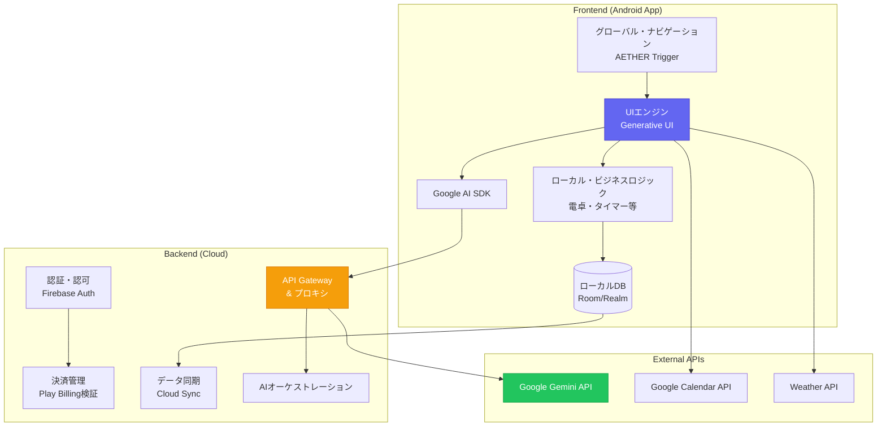
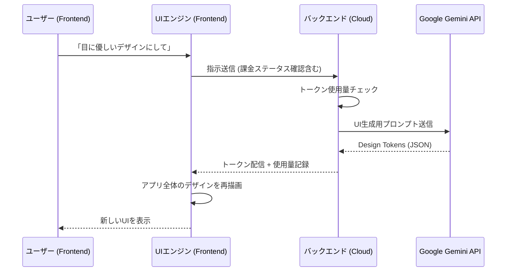
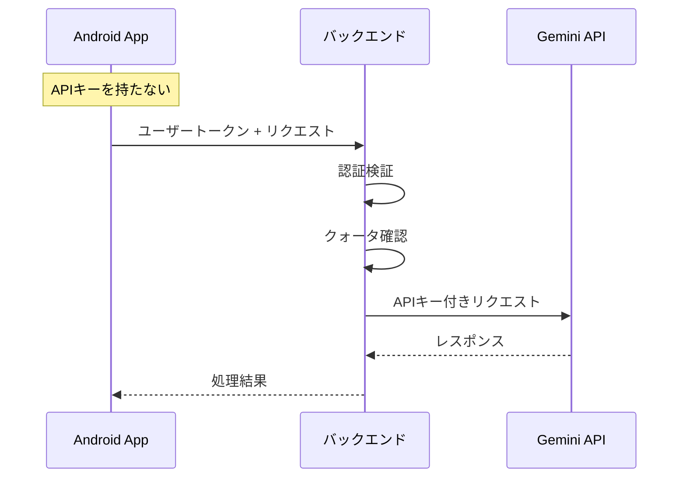

# AETHER システムアーキテクチャ

## 概要

本ドキュメントはAETHERのフロントエンド・バックエンド構成と、ローカル・ファースト設計思想を定義します。

---

## アーキテクチャ概観

---

## 1. フロントエンド（Client-side / Android App）

フロントエンドの主責務は**「ユーザー体験の提示」と「ローカルでの機能実行」、そして「AI指示の可視化」**です。

### 構成要素

| コンポーネント | 責務 |
|---------------|------|
| **UI/UX エンジン (Generative UI)** | Geminiから受け取ったDesign Tokens（JSON）を解析し、アプリ全体のテーマをリアルタイムに書き換え |
| **ローカル・ビジネスロジック** | 電卓の計算処理、タイマーのカウントダウン、ボイスレコーダーの制御。Android OS標準機能連携 |
| **グローバル・ナビゲーション** | AETHER Trigger（常駐UI）の描画と、画面間のシームレスな遷移管理 |
| **AI SDK 連携** | Google AI SDK for Android を介した Gemini との通信 |
| **ローカル・パーシスタンス** | ユーザーのメモデータ、設定、カスタムテーマのキャッシュ保存（Room / Realm） |

---

## 2. バックエンド（Server-side / Cloud）

バックエンドの主責務は**「ビジネスロジックの秘匿」、「セキュリティ」、および「データの永続化と同期」**です。

### 構成要素

| コンポーネント | 責務 |
|---------------|------|
| **認証・認可 (Auth)** | ユーザーアカウントの管理（Firebase Auth等） |
| **決済・サブスクリプション管理** | Google Play Billing からの領収書検証、ユーザーの課金ステータス（Free/Premium）判定と機能解放 |
| **API Gateway & プロキシ** | APIキー漏洩防止のため、Geminiへのリクエストをバックエンド経由に。ユーザーごとのトークン使用量カウントとクォータ管理 |
| **データ同期 (Cloud Sync)** | 複数デバイス間でのメモデータやカスタムテーマの同期 |
| **AI オーケストレーション** | 複雑なプロンプト管理（システムプロンプト更新）、Gemini Pro / Flash の動的ルーティング |

---

## 3. フロント・バックのデータフロー

---

## 4. ローカル・ファースト設計

ビジネス上の機密性（メモ内容の保護）とレスポンス速度を両立するため、**「ローカル・ファースト（Local-first）」**の設計を採用します。

### 設計原則

| 原則 | 説明 |
|------|------|
| **処理の優先順位** | 基本的な機能（計算やタイマー）は全てフロントエンドで完結させ、ネットワークがオフラインでも動作可能に |
| **プライバシー保護** | ユーザーのメモや音声データは原則ローカルに保存、明示的な同意なしにクラウドへ送信しない |
| **レスポンス速度** | 頻繁に使う機能はネットワーク遅延の影響を受けないローカル処理を優先 |

### AI処理の役割分担

| 処理場所 | 担当する処理 |
|----------|-------------|
| **フロントエンド** | UIの即時反映、シンプルな指示の解釈、オフライン時の基本機能 |
| **バックエンド** | 複雑なデータ解析（AIディレクター）、セキュアな決済処理、大規模なデータバックアップ |

---

## 5. セキュリティ設計

### APIキー保護

### セキュリティ対策一覧

| 対策 | 実装 |
|------|------|
| **APIキー秘匿** | フロントエンドにAPIキーを埋め込まない。バックエンド経由でのみAPI呼び出し |
| **トークン認証** | Firebase Auth トークンによるリクエスト認証 |
| **領収書検証** | Google Play RTDN によるサーバーサイドでの購入検証 |
| **データ暗号化** | ローカルDBの暗号化、通信のTLS必須化 |
| **クォータ管理** | ユーザーごとのAPI使用量制限で不正利用防止 |

---

## 6. 技術スタック詳細

| カテゴリ | 技術 | 備考 |
|----------|------|------|
| **モバイルフレームワーク** | Flutter | クロスプラットフォーム対応 |
| **ローカルDB** | Room / Realm | 高速なローカルデータ永続化 |
| **認証** | Firebase Auth | Google/メール認証 |
| **バックエンド** | Firebase Functions | サーバーレスアーキテクチャ |
| **AI API** | Google Gemini 1.5 | Pro/Flashの使い分け |
| **決済** | Google Play Billing v6.0+ | サブスクリプション管理 |
| **分析** | Firebase Analytics | ユーザー行動分析 |

---

## 関連ドキュメント

| ドキュメント | 説明 |
|--------------|------|
| [MONETIZATION.md](./MONETIZATION.md) | マネタイズ戦略 |
| [AETHER_SPECIFICATION.md](./AETHER_SPECIFICATION.md) | プロダクト仕様書 |
| [GEMINI_FUNCTION_CALLING.md](./GEMINI_FUNCTION_CALLING.md) | AI連携仕様 |
| [DATA_MODEL.md](./DATA_MODEL.md) | データベース設計 |
