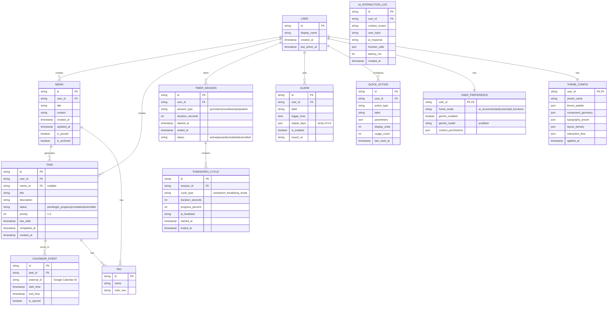

# AETHER データモデル設計書

## 概要

本ドキュメントはAETHERアプリケーションのデータ構造を定義します。

---

## ER図

---

## エンティティ詳細

### USER（ユーザー）

| フィールド | 型 | 説明 |
|------------|-----|------|
| `id` | string | Firebase Auth UID |
| `display_name` | string | 表示名 |
| `created_at` | timestamp | アカウント作成日時 |
| `last_active_at` | timestamp | 最終アクティブ日時 |

---

### USER_PREFERENCE（ユーザー設定）

| フィールド | 型 | 説明 |
|------------|-----|------|
| `home_mode` | enum | ホーム画面モード（ai_recommended / custom / all_functions） |
| `gemini_enabled` | boolean | Gemini機能の有効/無効 |
| `gemini_model` | enum | 使用するGeminiモデル（pro / flash） |
| `context_permissions` | json | AIに共有を許可するデータ種別 |

---

### THEME_CONFIG（テーマ設定）

Design Tokensをそのまま保持するエンティティ。

| フィールド | 型 | 説明 |
|------------|-----|------|
| `preset_name` | string | テーマ名（例：cyberpunk, minimal） |
| `theme_palette` | json | 色設定 |
| `component_geometry` | json | 形状設定 |
| `typography_preset` | json | 文字設定 |
| `layout_density` | json | 余白設定 |
| `interaction_flow` | json | アニメーション設定 |

---

### MEMO（メモ）

| フィールド | 型 | 説明 |
|------------|-----|------|
| `id` | string | UUID |
| `title` | string | タイトル（自動生成可） |
| `content` | string | 本文（Markdown対応） |
| `is_pinned` | boolean | ピン留め状態 |
| `is_archived` | boolean | アーカイブ状態 |

---

### TASK（タスク）

| フィールド | 型 | 説明 |
|------------|-----|------|
| `memo_id` | string? | 元メモのID（AI抽出時に設定） |
| `status` | enum | pending / in_progress / completed / cancelled |
| `priority` | int | 1（低）〜 5（高） |
| `due_date` | timestamp | 期限 |

---

### QUICK_ACTION（ワンタッチアクション）

| フィールド | 型 | 説明 |
|------------|-----|------|
| `action_type` | string | 実行する機能の識別子 |
| `label` | string | 表示ラベル（例：3分タイマー） |
| `parameters` | json | 実行時のパラメータ |
| `usage_count` | int | 使用回数（AIの推奨に使用） |

---

## ローカル/クラウド同期方針

| データ種別 | 保存先 | 同期方針 |
|------------|--------|----------|
| USER_PREFERENCE | ローカル + クラウド | 即時同期 |
| THEME_CONFIG | ローカル | デバイス固有（同期しない） |
| MEMO, TASK | ローカル + クラウド | 差分同期（5分間隔） |
| TIMER_SESSION | ローカルのみ | 同期しない |
| ALARM | ローカル + クラウド | デバイス間同期 |
| QUICK_ACTION | ローカル + クラウド | 即時同期 |
| AI_INTERACTION_LOG | ローカルのみ | 同期しない（プライバシー） |
