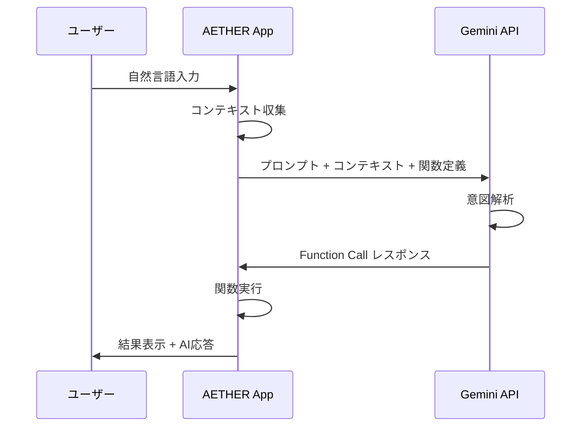

# AETHER Gemini Function Calling 仕様書

## 概要

本ドキュメントはGemini AIがAETHERアプリの機能を操作するためのFunction Calling定義を記載します。

---

## アーキテクチャ



---

## Geminiモデル使い分け

| モデル | 用途 | レイテンシ目標 |
|--------|------|---------------|
| **Gemini 1.5 Flash** | UI生成、クイック応答、単純な機能呼び出し | < 500ms |
| **Gemini 1.5 Pro** | 複雑な推論、スケジュール最適化、長文解析 | < 3s |

---

## Function Definitions

### 1. タイマー操作

```json
{
  "name": "timer_control",
  "description": "タイマー、ストップウォッチ、ポモドーロの操作",
  "parameters": {
    "type": "object",
    "properties": {
      "action": {
        "type": "string",
        "enum": ["start", "pause", "resume", "stop", "reset"],
        "description": "実行するアクション"
      },
      "timer_type": {
        "type": "string",
        "enum": ["countdown", "stopwatch", "pomodoro"],
        "description": "タイマーの種類"
      },
      "duration_seconds": {
        "type": "integer",
        "description": "カウントダウンの場合の秒数"
      },
      "label": {
        "type": "string",
        "description": "タイマーのラベル（任意）"
      }
    },
    "required": ["action", "timer_type"]
  }
}
```

**使用例：**
- 「3分タイマーをセットして」→ `timer_control(action="start", timer_type="countdown", duration_seconds=180)`
- 「ポモドーロ開始」→ `timer_control(action="start", timer_type="pomodoro")`

---

### 2. メモ操作

```json
{
  "name": "memo_control",
  "description": "メモの作成、編集、検索",
  "parameters": {
    "type": "object",
    "properties": {
      "action": {
        "type": "string",
        "enum": ["create", "update", "delete", "search", "read"],
        "description": "実行するアクション"
      },
      "memo_id": {
        "type": "string",
        "description": "操作対象のメモID（更新・削除時に必須）"
      },
      "title": {
        "type": "string",
        "description": "メモのタイトル"
      },
      "content": {
        "type": "string",
        "description": "メモの内容"
      },
      "search_query": {
        "type": "string",
        "description": "検索キーワード"
      }
    },
    "required": ["action"]
  }
}
```

---

### 3. タスク操作

```json
{
  "name": "task_control",
  "description": "タスクの作成、更新、完了",
  "parameters": {
    "type": "object",
    "properties": {
      "action": {
        "type": "string",
        "enum": ["create", "update", "complete", "delete", "list"],
        "description": "実行するアクション"
      },
      "task_id": {
        "type": "string",
        "description": "操作対象のタスクID"
      },
      "title": {
        "type": "string",
        "description": "タスクのタイトル"
      },
      "due_date": {
        "type": "string",
        "format": "date-time",
        "description": "期限（ISO 8601形式）"
      },
      "priority": {
        "type": "integer",
        "minimum": 1,
        "maximum": 5,
        "description": "優先度（1=低, 5=高）"
      },
      "sync_to_calendar": {
        "type": "boolean",
        "description": "Googleカレンダーに同期するか"
      }
    },
    "required": ["action"]
  }
}
```

---

### 4. アラーム操作

```json
{
  "name": "alarm_control",
  "description": "アラームの設定、変更、削除",
  "parameters": {
    "type": "object",
    "properties": {
      "action": {
        "type": "string",
        "enum": ["create", "update", "delete", "toggle", "list"],
        "description": "実行するアクション"
      },
      "alarm_id": {
        "type": "string",
        "description": "操作対象のアラームID"
      },
      "time": {
        "type": "string",
        "pattern": "^([01]?[0-9]|2[0-3]):[0-5][0-9]$",
        "description": "アラーム時刻（HH:MM形式）"
      },
      "label": {
        "type": "string",
        "description": "アラームのラベル"
      },
      "repeat_days": {
        "type": "array",
        "items": {
          "type": "integer",
          "minimum": 0,
          "maximum": 6
        },
        "description": "繰り返し曜日（0=日曜, 6=土曜）"
      }
    },
    "required": ["action"]
  }
}
```

---

### 5. テーマ変更

```json
{
  "name": "theme_change",
  "description": "アプリのテーマ・デザインを変更",
  "parameters": {
    "type": "object",
    "properties": {
      "preset": {
        "type": "string",
        "enum": ["default", "cyberpunk", "minimal", "nature", "sunset"],
        "description": "プリセットテーマ名"
      },
      "custom_tokens": {
        "type": "object",
        "description": "カスタムDesign Tokens（プリセットより優先）",
        "properties": {
          "theme_palette": { "type": "object" },
          "component_geometry": { "type": "object" },
          "typography_preset": { "type": "object" },
          "layout_density": { "type": "object" },
          "interaction_flow": { "type": "object" }
        }
      }
    }
  }
}
```

---

### 6. 計算・変換

```json
{
  "name": "calculate",
  "description": "計算または単位・通貨変換を実行",
  "parameters": {
    "type": "object",
    "properties": {
      "type": {
        "type": "string",
        "enum": ["arithmetic", "unit_conversion", "currency_conversion"],
        "description": "計算の種類"
      },
      "expression": {
        "type": "string",
        "description": "計算式（arithmetic時）"
      },
      "value": {
        "type": "number",
        "description": "変換元の値"
      },
      "from_unit": {
        "type": "string",
        "description": "変換元の単位"
      },
      "to_unit": {
        "type": "string",
        "description": "変換先の単位"
      }
    },
    "required": ["type"]
  }
}
```

---

### 7. ナビゲーション

```json
{
  "name": "navigate",
  "description": "画面遷移を実行",
  "parameters": {
    "type": "object",
    "properties": {
      "destination": {
        "type": "string",
        "enum": [
          "home", "calculator", "memo", "timer", "calendar",
          "alarm", "stopwatch", "converter", "voice_recorder",
          "file_manager", "scanner", "weather", "notifications",
          "media_controller", "app_launcher", "settings"
        ],
        "description": "遷移先の画面"
      },
      "params": {
        "type": "object",
        "description": "画面に渡すパラメータ"
      }
    },
    "required": ["destination"]
  }
}
```

---

### 8. 天気情報取得

```json
{
  "name": "get_weather",
  "description": "天気・環境情報を取得",
  "parameters": {
    "type": "object",
    "properties": {
      "location": {
        "type": "string",
        "description": "場所（省略時は現在地）"
      },
      "forecast_days": {
        "type": "integer",
        "minimum": 1,
        "maximum": 7,
        "description": "予報日数"
      }
    }
  }
}
```

---

## コンテキスト設計

各画面からGeminiに送信するコンテキスト情報：

| 画面 | 送信するコンテキスト |
|------|----------------------|
| ホーム | 現在時刻、最近使った機能、未完了タスク数 |
| メモ | 開いているメモの内容、メモ数 |
| タイマー | 現在のタイマー状態、残り時間 |
| カレンダー | 表示中の日付、当日の予定一覧 |
| 電卓 | 直近の計算履歴 |

---

## エラーハンドリング

| エラー種別 | 対処 |
|------------|------|
| API接続エラー | オフラインモードに切り替え、ローカル処理を試行 |
| 関数実行失敗 | ユーザーに失敗理由を通知、代替操作を提案 |
| レート制限 | キュー処理、指数バックオフで再試行 |
| 不明な意図 | 「もう少し詳しく教えてください」と確認 |

---

## レート制限対策

| 対策 | 実装 |
|------|------|
| リクエストキャッシュ | 同一クエリは1分間キャッシュ |
| デバウンス | 入力完了から300ms後にリクエスト |
| バッチ処理 | 連続操作は1リクエストにまとめる |
| ローカル判定 | 簡単な操作はローカルで判定 |
