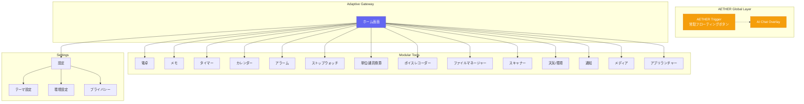
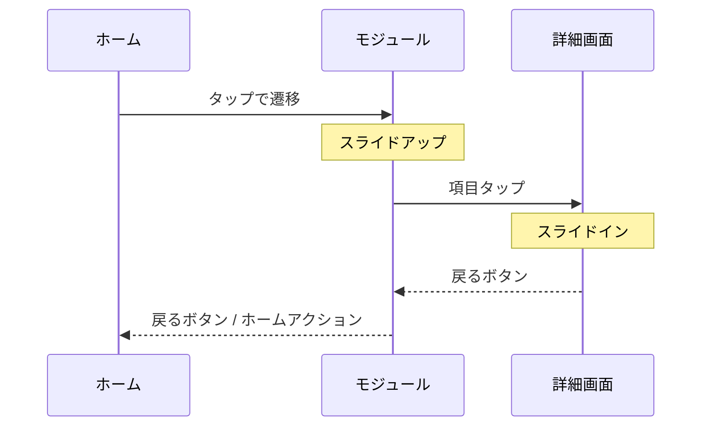
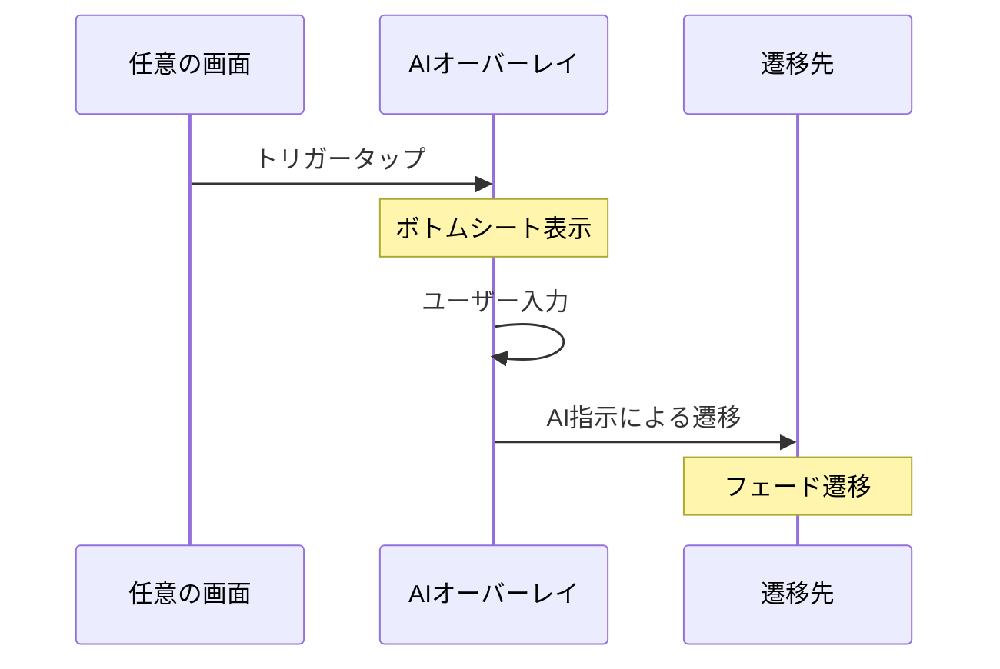
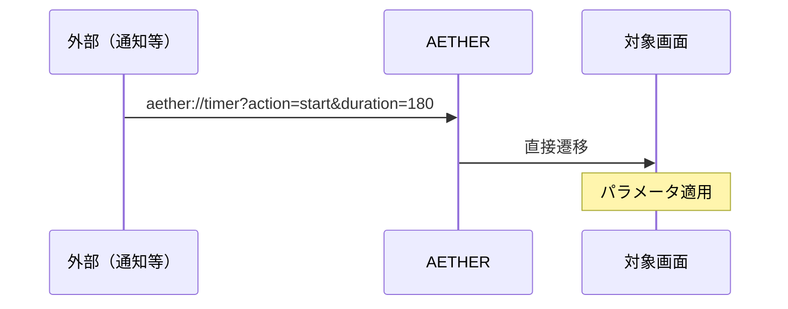

# AETHER ナビゲーションマップ

## 概要

本ドキュメントはAETHERアプリの画面構成と遷移フローを定義します。

---

## 画面階層図

---

## 画面一覧

| ID | 画面名 | 説明 | ルート |
|----|--------|------|--------|
| `home` | ホーム | アダプティブ・ゲートウェイ | `/` |
| `calculator` | 電卓 | 基本・関数計算 | `/calculator` |
| `memo` | メモ | メモ一覧・フォルダ管理・編集 | `/memo` |
| `memo_detail` | メモ詳細 | 単一メモ編集 | `/memo/:id` |
| `time_clock` | タイムクロック | タイマー・ストップウォッチ（タブ切替） | `/time-clock` |
| `calendar` | カレンダー | 月間・週間・日間表示 | `/calendar` |
| `calendar_event` | イベント詳細 | 予定の作成・編集 | `/calendar/event/:id` |
| `alarm` | アラーム | アラーム一覧・設定 | `/alarm` |
| `converter` | 換算 | 単位・通貨変換 | `/converter` |
| `voice_recorder` | ボイスレコーダー | 録音・再生 | `/voice` |
| `file_manager` | ファイル | ファイル管理 | `/files` |
| `scanner` | スキャナー | ドキュメントスキャン | `/scanner` |
| `weather` | 天気 | 天気・環境情報 | `/weather` |
| `notifications` | 通知 | 通知アグリゲーター | `/notifications` |
| `media_controller` | メディア | 再生コントロール | `/media` |
| `app_launcher` | ランチャー | 外部アプリ起動 | `/launcher` |
| `settings` | 設定 | アプリ設定・言語・テーマ | `/settings` |
| `theme_settings` | テーマ設定 | デザイン変更 | `/settings/theme` |
| `preferences` | 環境設定 | 動作設定 | `/settings/preferences` |
| `privacy` | プライバシー | データ・権限管理 | `/settings/privacy` |

---

## 遷移パターン

### 1. 標準遷移

### 2. AIトリガー遷移

### 3. ディープリンク

---

## ディープリンク設計

### URLスキーム

`aether://[screen]/[action]?[params]`

### 対応リンク一覧

| リンク | 動作 |
|--------|------|
| `aether://home` | ホームを開く |
| `aether://timer?action=start&duration=180` | 3分タイマー開始 |
| `aether://memo?action=create` | 新規メモ作成 |
| `aether://memo/abc123` | 特定メモを開く |
| `aether://alarm?action=create&time=07:00` | 7時アラーム作成 |
| `aether://calendar?date=2026-01-15` | 特定日を表示 |
| `aether://converter?from=USD&to=JPY&value=100` | 換算実行 |

---

## 状態管理

### グローバル状態

| 状態名 | 型 | 説明 |
|--------|-----|------|
| `currentUser` | User | ログインユーザー情報 |
| `themeConfig` | ThemeConfig | 適用中のテーマ |
| `geminiContext` | Map | AIに渡すコンテキスト |
| `activeTimers` | List | 実行中タイマー |
| `pendingTasks` | int | 未完了タスク数 |

### 画面ローカル状態

各画面は独自の状態を持ち、画面スタックから削除されると破棄される。

---

## ナビゲーションルール

| ルール | 説明 |
|--------|------|
| **一撃帰還** | どの深さからでもワンアクションでホームへ戻れる |
| **状態保持** | バックスタックにある画面の状態は保持される |
| **コンテキスト継承** | 遷移元画面のコンテキストをAIに渡せる |
| **アニメーション統一** | Design Tokensのtransitions設定に従う |

---

## アクセシビリティ対応

- フォーカス順序は論理的な読み順に従う
- 全てのインタラクティブ要素にセマンティックラベルを付与
- スクリーンリーダー使用時はモーダル遷移を明示的にアナウンス
